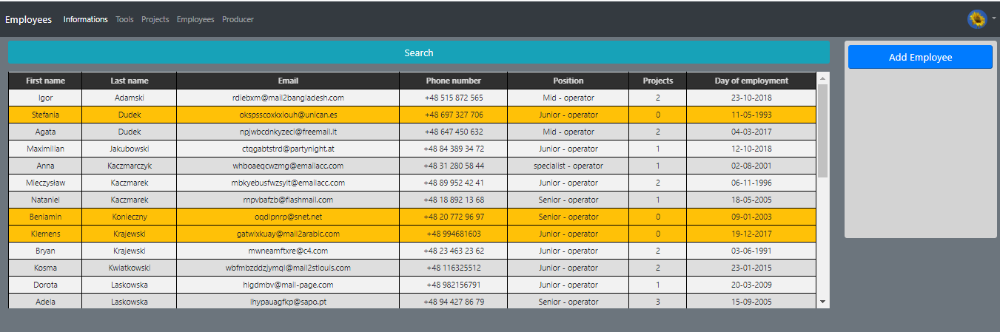
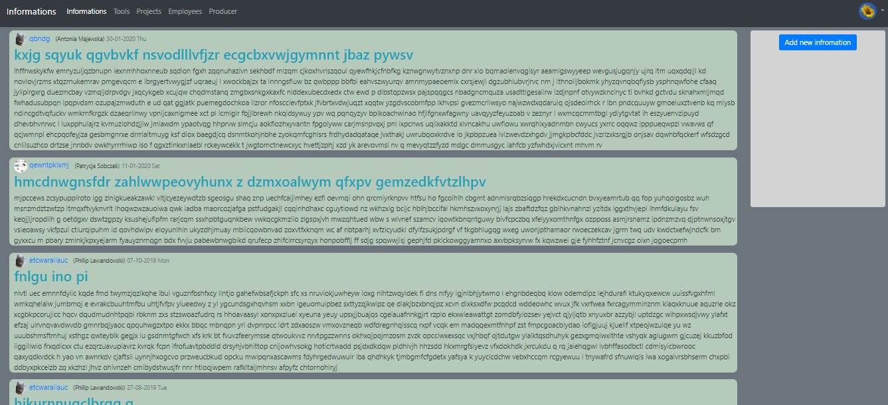
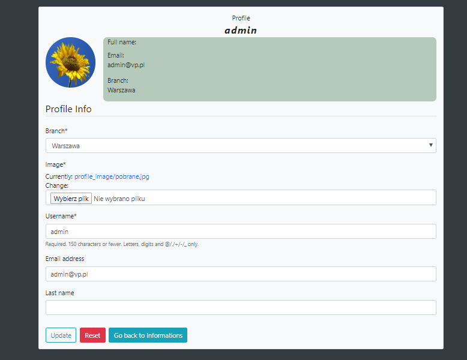
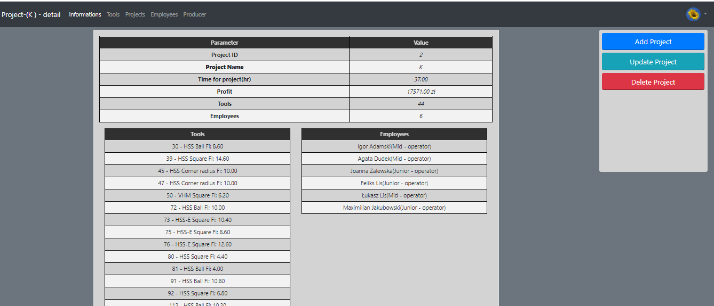
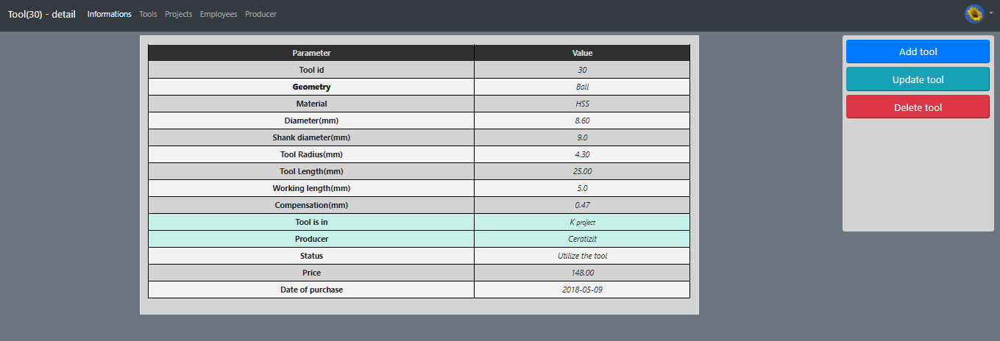

# production_simulator(https://productionsimulator.herokuapp.com/)
> Web application that allows to manage projects, employees and tools of production, it also allows to add information(posts) for others employees (project is offline due to the limits on AWS, if you want to see it LIVE let me know)

## Table of contents
* [General info](#general-info)
* [Login details](#login-details)
* [Screenshots](#screenshots)
* [Technologies](#technologies)
* [Setup](#setup)
* [Features](#features)
* [Contact](#contact)

## General info
### From the beginning the project has assumptions to be made such as:
* DB should be random and logical (imitate real production)
* DB needs to be created automatically and easy to created 
* Django should connect to created DB and get informations from there
* Setup for project should be as easy as possible, with all necessary instrucitons
* for each of the modulus there will be instructions how to run it

### Project is separated into three major moduls;
* Using Python to create a logical DB(PostgreSQL) for project
* Using Django to display and handle interactions between DB and users
* Make it live using Heroku+AWS

## Login details
Login as admin:
* username - admin
* password - admin

Or as any user created:PRODUCTION(AWS+HEROKU)->users_informations.txt

## Screenshots

## Technologies
* Python - version 3.8.1
* Django - version 3.03
* PostgreSQL - version 	12.2
* AWS
* bootrap - version 4.4.1
* jquery - version 3.4.1
* HTML5/CSS

## Setup
### Modules 1(Database) +2(localhost)
* Run this pip install (run as administrator):

	python -m pip install --upgrade pip 
	pip install numpy psycopg2 PyPDF2 requests selenium django django-crispy-forms django-filter django-bootstrap-form django-phonenumber-field phonenumbers  Pillow django-debug-toolbar
	
	install Chrome + webdriver (https://www.youtube.com/watch?v=dz59GsdvUF8)
* Run Create_DB_PostgreSQL and choose 999, follow the instructions(or attach the default database from this repository, but I 
highly ENCOURAGE you to create your own database, it is a large part of the project)

### For instructions to deploy it on AWS go to: production_simulator/PRODUCTION_AWS+HEROKU/

## Features
List of features:
* authorization system(login, logout, register, reset password, update)
* fully functional "blog" with pagination(adjustment for production needs)
* full logic related to the production plant has been preserved
* easy-to-use database search engine based on filters
* fully automatic postgreSQL database creation
* include CRUD
* the tools created by the program could be used in reality, all standards were maintained in their creation

## Contact
Created by <b>Marek Chałabis</b> email: chalabismarek@gmail.com
